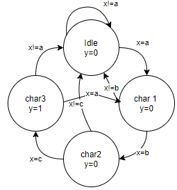
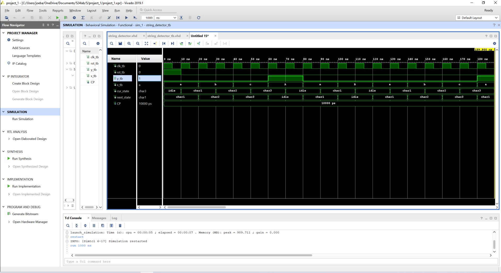
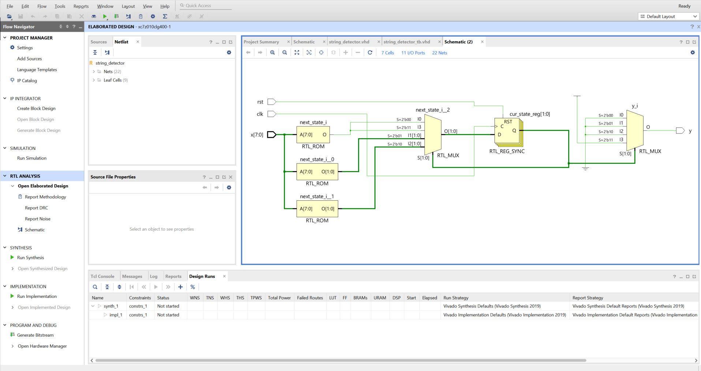
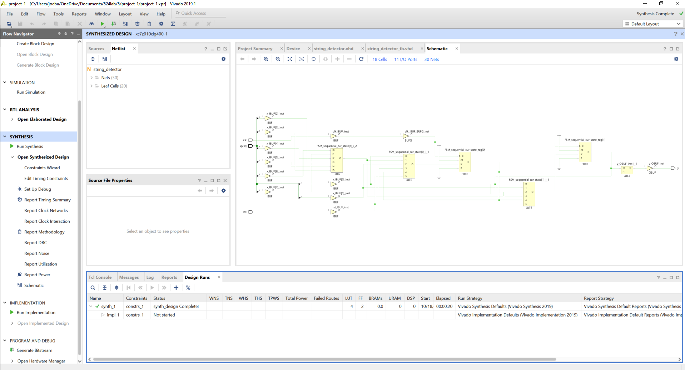
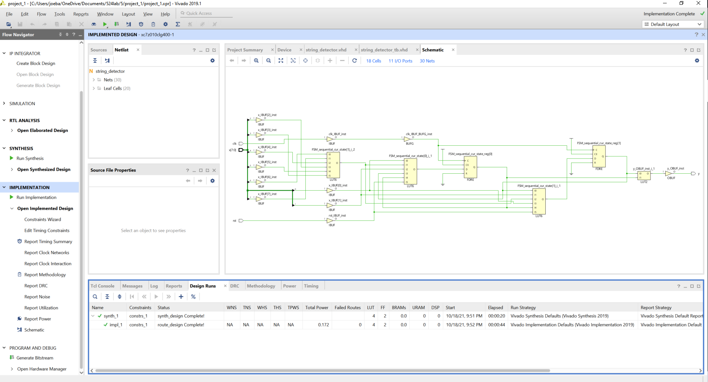

# CSUN ECE 524L Fall 2021
## Lab 4 - Part 2

**Report Created by:**
- Group 2 
- Joseph Barchanowicz
- Morris Blaustein
- Karl Garcia

**Submission date:** 10/26/2021

## Introduction
For lab 5 we were asked to design and implement a simple Finite State Machine to detect the ASCII sequence "abc".
As per the directions the FSM component should have the following ports:

```vhdl
port (
    clk: in std_logic;
    rst: in std_logic;
    x : in character;
    y: out std_logic);
```
It will accept one character at a time and will output 1 if it detects the last required character of the pattern.

## Pre-Lab
Not applicable for this lab.

## Procedure
:point_right: **Task 1:** Design an FSM transition diagram. Provide a screenshot of your diagram design.
Clearly state the type of selected FSM type (e.g. Moore, Mealy).  
Task 1 askes us to design an FSM transition diagram.  Because we are using a fully synchronous system and the output is determined only by the current state, the FSM type that we will be using is a Moore Machine. Figure 5.1, shows the Moore state diagram that was used to model our code for the ASCII pattern detector.  
  
Figure 5.1: ASCII pattern detector Moore State Diagram  

:point_right: **Task 2:** Implement the FSM in VHDL. Create testbench to prove the functionality of the design.  
Task 2 askes us to implement the FSM design in VHDL and create a testbench to prove the functionality of the design.  The output waveform is located in figure 5.2 in the results section.  
```vhdl
library IEEE;
use IEEE.STD_LOGIC_1164.ALL;


entity string_detector is
    Port ( clk : in STD_LOGIC;
           rst : in STD_LOGIC;
           x : in character;
           y : out STD_LOGIC);
end string_detector;

architecture Behavioral of string_detector is

type state is (idle, char1, char2, char3);
signal cur_state, next_state : state;

begin
process(clk, rst)
begin
    if(rising_edge(clk)) then
        if(rst = '1') then
            cur_state <= idle;
        else
            cur_state <= next_state;
        end if;
    end if;
end process;

process(x)
begin
    case cur_state is
        when idle => 
            if (x = 'a') then
                next_state <= char1;
            else
                next_state <= idle;
            end if;
        when char1 =>
            if (x = 'b') then
                next_state <= char2;
            else
                next_state <= idle;
            end if;
        when char2 =>
            if (x = 'c') then
                next_state <= char3;
             else
                next_state <= idle;
             end if;
         when char3 =>
            if (x = 'a') then
                next_state <= char1;
            else
                next_state <= idle;
            end if; 
    end case; 
end process;

process(x)
begin
    case cur_state is
        when idle => 
                y <= '0';
        when char1 =>
                y <= '0';
        when char2 =>
                y <= '0';
         when char3 =>
                y <= '1';
    end case; 
end process;

end Behavioral;
```

## Testing Strategy
The testing strategy that was used was to create a testbench that covered a few cases where the sequence was correct (abc), as well as a few incorrect cases to show that the state machine will go back to the idle state.  

```vhdl
library IEEE;
use IEEE.STD_LOGIC_1164.ALL;

entity string_detector_tb is
--  Port ( );
end string_detector_tb;

architecture Behavioral of string_detector_tb is

component string_detector is
    Port ( clk : in STD_LOGIC;
           rst : in STD_LOGIC;
           x : in character;
           y : out STD_LOGIC);
end component string_detector;

signal clk_tb, rst_tb, y_tb : std_logic;
signal x_tb : character;

constant CP : time := 10 ns;

begin
UUT: string_detector port map (clk => clk_tb, rst => rst_tb, x => x_tb, y => y_tb);

process
begin
    clk_tb <= '1';
    wait for CP/2;
    clk_tb <= '0';
    wait for CP/2;
end process;

process
begin
    rst_tb <= '1';
    wait for 10 ns;
    rst_tb <= '0';
    wait;
end process;

process
begin
    x_tb <= 'a';
    wait for 20ns;
    x_tb <= 'b';
    wait for 20ns;
    x_tb <= 'c';
    wait for 20ns;
    x_tb <= 'A';
    wait for 20ns;
    x_tb <= 'a';
    wait for 20ns;
    x_tb <= 'B';
    wait for 20ns;
    x_tb <= 'a';
    wait for 20ns;
    x_tb <= 'b';
    wait for 20ns;
    x_tb <= 'c';
    wait for 20ns;
end process;

end Behavioral;
```

## Results (Data)
  
Figure 5.2: ASCII pattern detector output waveform 

## FPGA Resources

Figure 5.3: RTL Design  


Figure 5.4: Synthesis


Figure 5.5: Implementation

****

## Conclusion
By performing this experiement, we were able to accomplish our goals of learning about the design control unit using FSM, implementing FSM using VHDL, and how to infer FPGA resources. For this lab, we were able to successfully design and implement a simple Finite State Machine (FSM) to detect the ASCII sequence "abc". After designing our FSM, we created a testbench to test the FSM if it will detect the ASCII sequence "abc". After observing our waveform, we concluded that our design was a success because it was able to correctly detect the ASCII sequence "abc". No problems were encountered for this lab.  

-------------
-------------

# Is assignment ready for review? Yes
