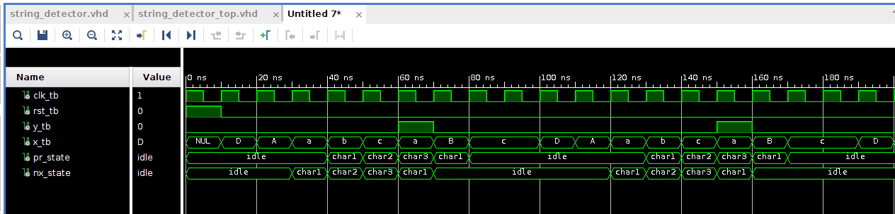

# ECE 524L Fall 2021
**California State University, Northridge**  
**Department of Electrical and Computer Engineering**  

## Lab 4 - Part 2 ASCII-sequence detector

## Objective

After completing this lab, students will be able to:
- Design control unit using FSM
- Implement FSM using VHDL
- Infer FPGA resources

## Requirements

The following material is required to complete the lab:
- Xilinx Vivado 2019.1

## References

- Xilinx FPGA datasheets (available at http://www.xilinx.com)
- Software Manual (available at http://www.support.xilinx.com)

## Introduction

In this lab you are going to design and implement a simple Finite State Machine to detect the ASCII sequence "abc".
The FSM component should have the following ports:

```vhdl
port (
    clk: in std_logic;
    rst: in std_logic;
    x : in character;
    y: out std_logic);
```
It will accept a character at a time and will output 1 if it detects the last required character of the pattern.

You should choose your preferred FSM design type (e.g Moore, Mealy) and draw the state state transition diagram.
You can choose any professional diagram design tools such as Microsoft Visio or MagicDraw. If you do not have access to
these commercial software you can use draw.io (https://app.diagrams.net/) for your design.
This lab is meant to be simple and straight forward to allow you focus on the implementation of the FSM.
An example of output waveform is shown below:


Figure 1. An example of output waveform for ASCII pattern detector

:point_right: **Task 1:** Design an FSM transition diagram. Provide a screenshot of your diagram design.
Clearly state the type of selected FSM type (e.g. Moore, Mealy).

:point_right: **Task 2:** Implement the FSM in VHDL. Create testbench to prove the functionality of the design.
